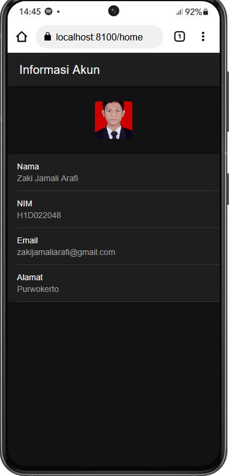

    Nama       : Zaki Jamali Arafi

    NIM        : H1D022048

    Shift Baru : D

# Tugas 6 Pertemuan 7
## Cara menambahkan Komponen di halaman Ionic

1. Memilih component
Ionic Framework menyediakan component-component UI di [Ionic Framework Documentation](https://ionicframework.com/docs), pilih component yang diinginkan.

contoh component :
ion-avatar
```html
<ion-avatar>
  
</ion-avatar>
```

2. Menyalin component ke kode
setelah menemukan component yang cocok, copy kode dan letakan pada file `home.page.html` pada folder `src\app\home\home.page.html`.

```html
<ion-header [translucent]="true">
  <ion-toolbar>
    <ion-title>
      Informasi Akun
    </ion-title>
  </ion-toolbar>
</ion-header>

<ion-content [fullscreen]="true">
  <ion-header collapse="condense">
    <ion-toolbar>
      <ion-title size="large">Informasi Akun</ion-title>
    </ion-toolbar>
  </ion-header>


  <ion-avatar >
    
  </ion-avatar>
  
</ion-content>
```

3. Mengubah style component
tambahkan css ke file home.page.scss
```html
ion-avatar {
  --border-radius: 4px;
  margin: 26px auto;
}
```

## Screenshot
